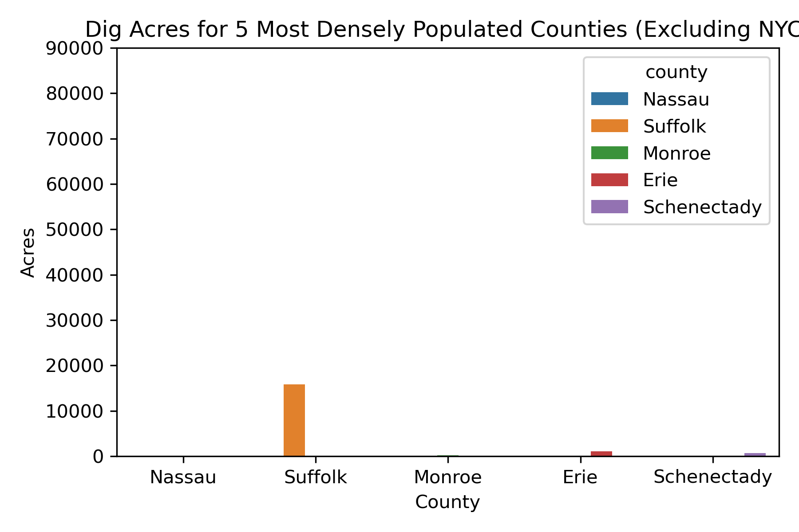
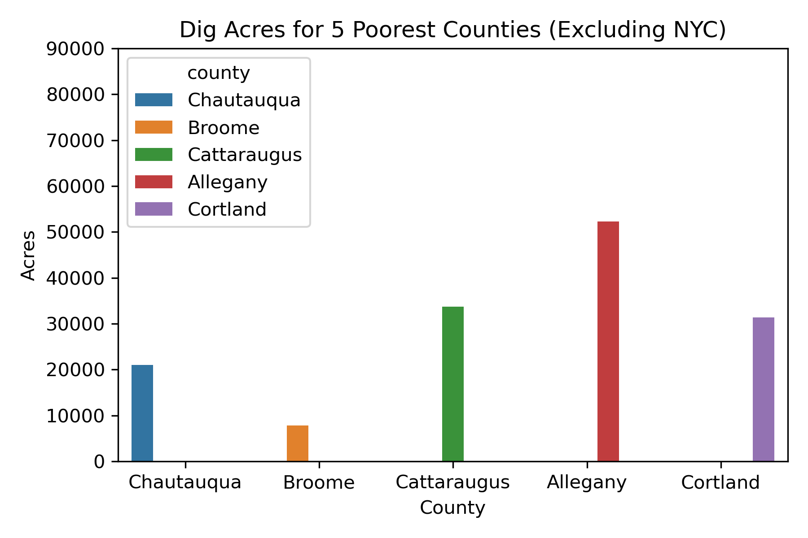
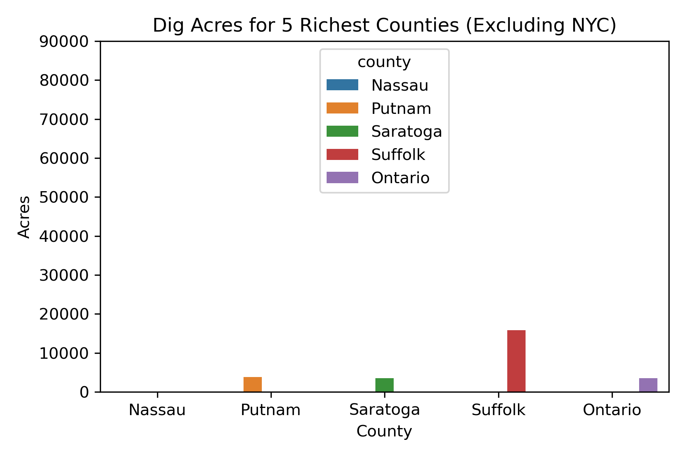
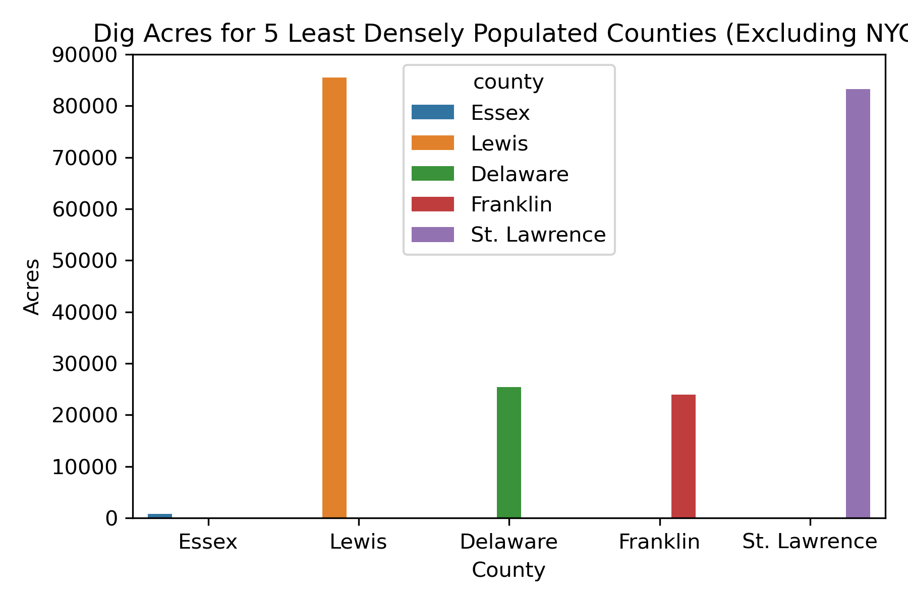
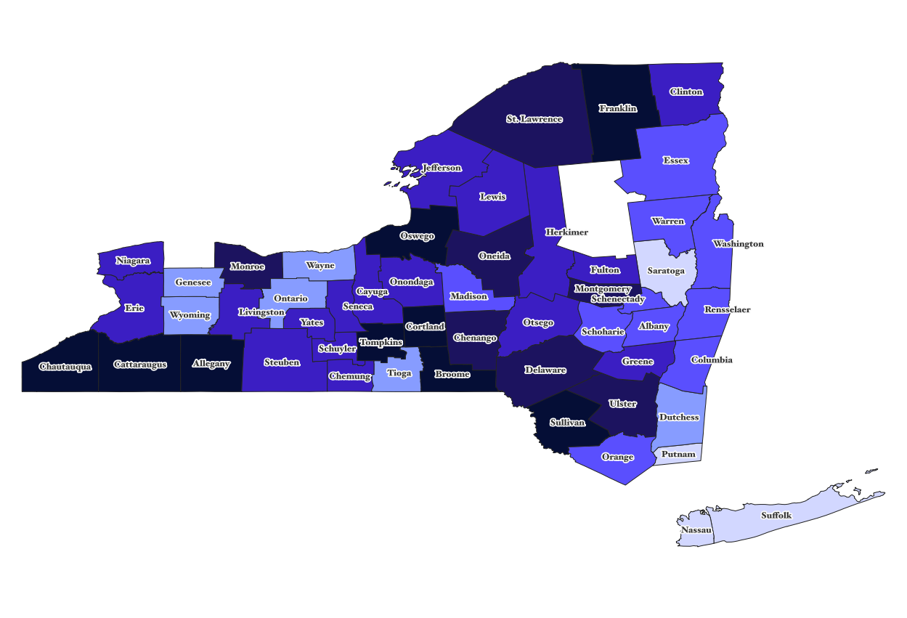
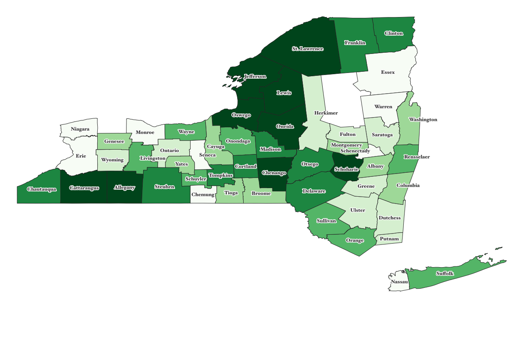
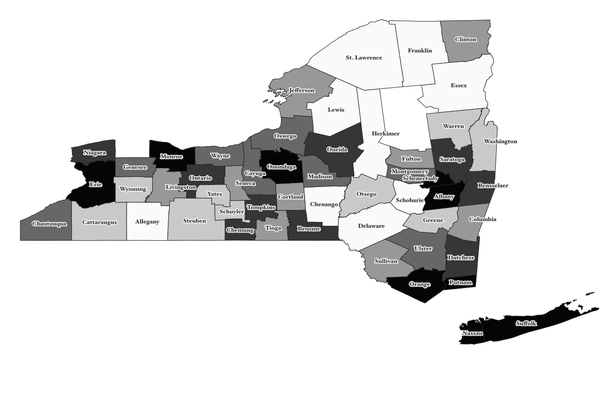

# NYS_Trees_BD_dev
## Introduction

Forests are a great source of biodiversity. Biodiversity is the variety of life in an ecosystem. It is an important indicator of a healthy ecosystem. Forests also act as carbon sinks - storing more carbon than they release. This is important for the reduction of the effects of climate change. Carbon sinks also limit the amount of greenhouse gases released into the atmosphere, as long as the carbon stored is not released by people. 

Forests are beneficial not only to the creatures that live in them, but to humans as well. Forests are useful for recreational purposes and promote mental and physical health. Some health benefits of forests include immune system boosts, lowered blood pressure,reduced stress. and improved sleep [(NYC DEC)](https://www.dec.ny.gov/lands/90720.html)
.

## Data

### *Forest Stands Dataset* 
[DEC State Land Forest Stands Dataset](https://gis.ny.gov/gisdata/inventories/details.cfm?DSID=1356)
- This dataset excludes NYC (Kings, Queens, New York, Bronx, Richmond), Rockland, Weschester, Orleans, and Hamilton counties.

[Census Population Data (API)](https://api.census.gov/data/2019/pep/population.html)

US State and County names and FIPS codes
- Found on Google
- Link: www.schooldata.com/pdfs/US_FIPS_Codes.xls

[NYS Poverty Rates by County](https://www.indexmundi.com/facts/united-states/quick-facts/new-york/percent-of-people-of-all-ages-in-poverty#table)

New York State Shapefile
- cb_2019_us_county_500k_36.zip
- Contains geometric information of New York State Counties

## Python Scripts
### *data_prep.py*
- Reads in all data needed for analysis
- Selects columns from State Land Forest Stands Dataset 
- Requests data from Census API server
- Uses US State and County names/FIPS codes data to merge with Census data. 

### *figures.py*
- Bar charts comparing most and least densely populated counties and poorest and richest counties

## Outputs
### *CSV Files*
1. forest_counties.csv
    - Used for QGIS maps
    -  Variables:
        - county: county name
        - STAND_BASA: The cross-sectional area of all stems of a species or all stems in a stand measured at breast height and expressed in sq/ft
        - DIG_ACRES: Acreage of the stand as digitized
        - DENSITY: Population density (per square mile)
        - GEO_ID
        - POP: population
        - Poverty_Rate: Poverty rate (percent)
2. forest_data.csv
    - Variables:
         - STAND_BASA: The cross-sectional area of all stems of a species or all stems in a stand measured at breast height and expressed in sq/ft
        - DIG_ACRES: Acreage of the stand as digitized
        - DIG_YEAR: Year of last adjustment to a State Forests stand boundaries
        - TREE_TYPE1: The 3 species of greatest prominence in the stand. Tree type 1 would occupy the greatest percentage of the stand basal Area, followed by Tree type 2 etc
        - CALC_FT: Primary forest cover type (sfid calculated)
        - county: county name
3. nys_poverty.csv
    - Variables:
        -  county: county name
        - Poverty_Rate: Poverty rate (percent)
4. population.csv
    - Variables:
        - DENSITY: Population density (per square mile)
        - GEO_ID
        - POP: population
        - county: county name
        - Poverty_Rate: Poverty rate (percent)

### *Graphs*
- acres_dense_counties.png

- acres_poor_counties.png

- acres_rich_counties.png

- acres_sparse_counties.png

### *Maps*
All maps were created using QGIS
- ny_pop_poverty.png

- nys_forest_acres.png

- nys_pop_density.png

## Discussion
Visual comparisons of the graphs and maps show that sparsley populated counties tend to have larger forest acreage. Densely populated counties tend to have lower forest densities and lower rates of poverty. The most densley populated counties are located near or contain major cities in New York State. Because cities have so many residents, it is likely that there are wider incomde ranges in counties containing or near major cities. Cities also tend to have higher living costs than rural areas. This is likely a factor in the difference in population densities and poverty rates across New York State counties. 

Further analysis is necessary to better understand the relationship between forest acreage, county population density, and poverty rates. 

